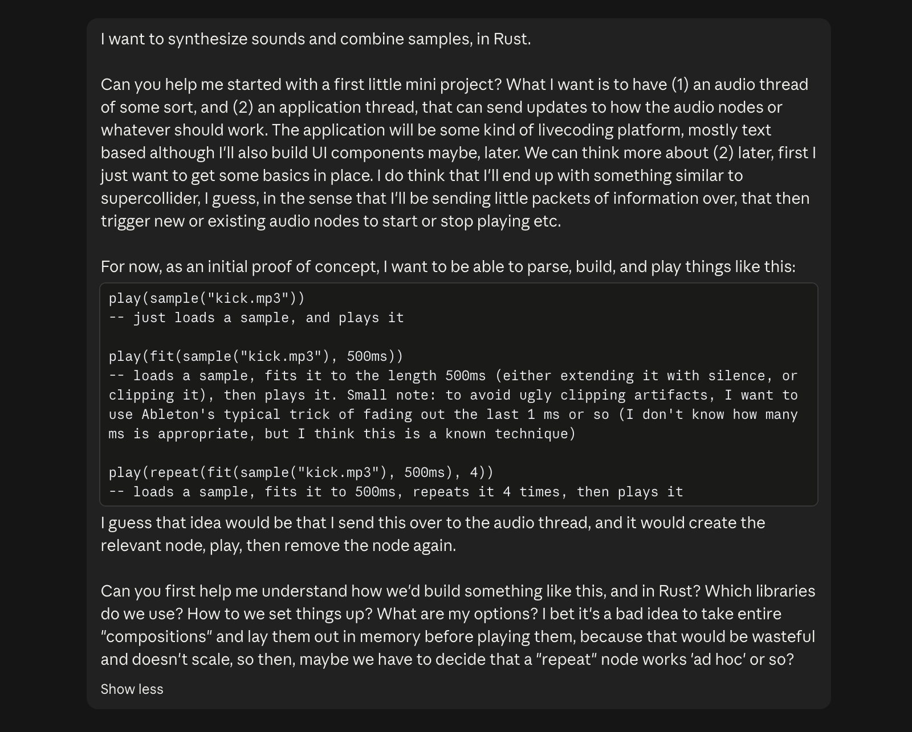
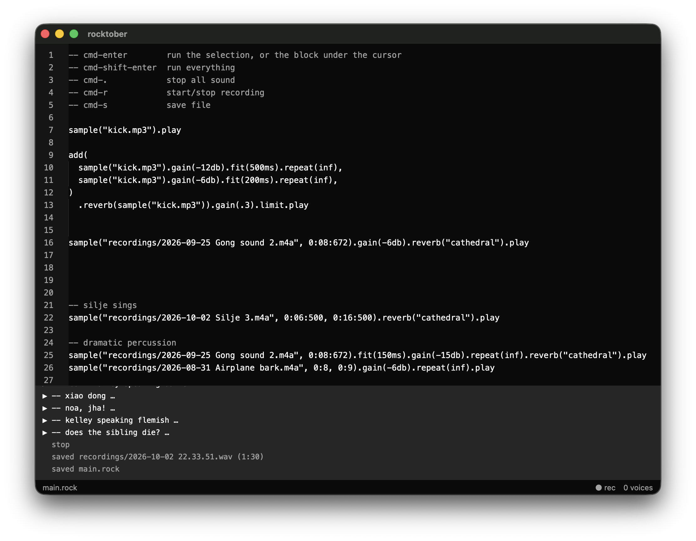
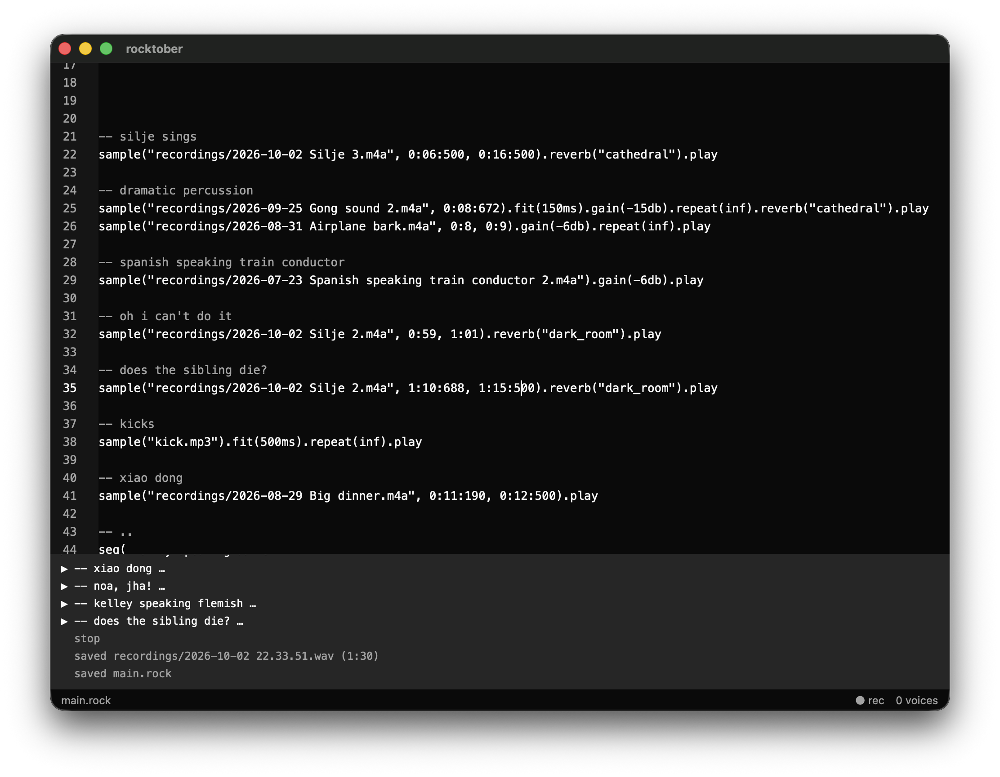

# Rocktober 2026

## Oct 1

I already failed on day 1 😅 After a work outing and having had some drinks, I only had a few hours left, so I decided to just dust off Ableton (which I hadn't opened for over a year) and make something fast and silly. This is what I ended up with. (Best listened with headphones, ofc.)

## Oct 2

Today, I started off on the actual project: to just go ahead and create some kind of livecoding environment, fast, with the help and speed of AI, and then make music with it. Similar to how some years ago, I was creating my own language during advent of code, every day I'd add the necessary features to complete the day's programming task. But now with the help of AI. Especially useful in this case, because I've been thinking a lot but procrastinating forever, this audio processing kind of stuff. My first prompt:



Claude finished in a few minutes, what I'd been procrastinating to do for a few years now 🫣. But yeah, AI is just so good now at synthesizing / reproducing human knowledge, that it can just whip it out, just like that. Mind you, this isn't any engineering marvel, SuperCollider and others solved the basic engineering principle long ago, it's just quite technical and takes some time to understand the principles and put them together systematically.

What it built:

The **architecture** is basically just SuperCollider Mini, as I prompted it: two threads, an audio thread and an application thread. The audio thread just processes audio in a pull-based fashion, as fast as possible, without any memory allocations, file reads, etc. The application thread sends it audio nodes and commands, on the basis of whatever logic/UI/REPL it has. In this first iteration, just a simple REPL.

```
app thread                                         audio thread (cpal callback)
───────────                                        ──────────────────────────────
text ─▶ parse ─▶ eval ─▶ Sound (description)
                          │ play(): instantiate
                          ▼
                  Box<dyn Node> ── commands queue ─▶ Engine: pop commands,
                  (built, allocated, samples         mix active voices,
                   already decoded)                   remove finished ones
                                                         │
           drop it here ◀── garbage queue ───────────────┘
```

Claude split the work into 6 files, perfectly simple and logical, each of them only 100-200 lines of code.

- `src/sample.rs` to decode mp3/wav/flac/ogg files using `symphonia`
- `src/lang.rs` - a lexer and parser (Claude has no objection hand-writing them, I always hate this and would rather use parser combinators)
- `src/eval.rs` - semantic (type-ish) checking of the AST to build a sound description
- `src/nodes.rs` - the audio node implementations
- `src/engine.rs` - the audio thread
- `src/main.rs` - setup the audio device, mini REPL implementation, `cpal` callback, and then tie things together

And then I just changed the syntax to postfix / method chaining because it's easier to author, and added some more nodes. The nodes I now have:

```
node.play

node.gain(fraction or decibels)
node.fit(duration)
node.delay(duration)
node.slice(start, end)
node.repeat(times)
node.limit([decibels])
node.reverb(preset or filename)

add(...nodes)
seq(...nodes)
sample(filename[, start[, end]])
```

I have yet to add (1) more audio effects, (2) sound synthesis/generation, and (3) maybe most importantly for tomorrow, some kind of timing or scheduling mechanism, patterns, or whatever. The last one sounds easy if I'd just add a very basic rhythm clock and scheduling, but I want something more interesting and variable of course. Ah and of course (4) modulation, and maybe that's actually how I can make (3) more interesting? I'll have to think about this some more, first...

Anyhow, for today, this is enough. I did add some UI though, using Zed's `gpui`. And then I chose some samples, added a live recording functionality, played some nonsense, and called it a day. This is where I ended:

<table>
    <tbody>
        <tr>
            <td></td>
            <td></td>
        </tr>
    </tbody>
</table>
